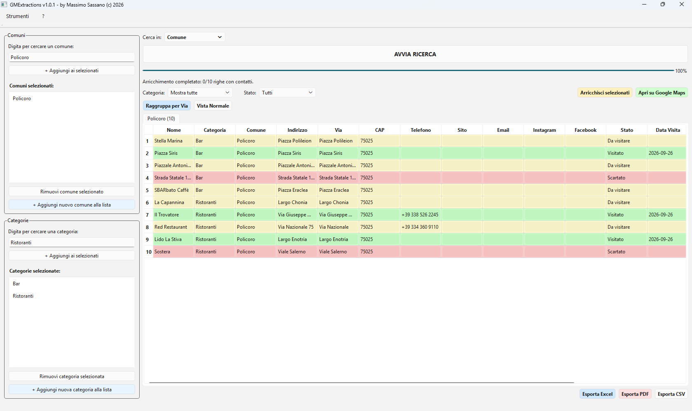

# GMExtractions — Software di Estrazione Attività

  

Applicazione Windows per estrarre attività commerciali (bar, ristoranti, alberghi,
negozi, ecc.) da comuni, province o regioni italiane, con esportazione in
Excel / PDF / CSV, schede separate per comune e raggruppamento per via.

**Versione:** 1.1.0  
**Autore:** Massimo Sassano  
**Anno:** 2026

---

## 1. Requisiti

- Windows 10 o superiore (64-bit)
- Connessione Internet
- Account gratuito **Geoapify** (per la API Key)

---

## 2. Come ottenere la API Key GRATUITA

1. Vai su **https://www.geoapify.com/**
2. Clicca in alto a destra su **"Sign up"** (Registrati)
3. Inserisci **email** e **password** (nessuna carta di credito richiesta)
4. Conferma l'email tramite il link che ricevi
5. Accedi al tuo account
6. Vai su **https://myprojects.geoapify.com/**
7. Clicca **"Create new project"** → dai un nome (es. `GMExtractions`)
8. Nella pagina del progetto, sezione **"API Keys"**, trovi la tua chiave
9. **Copia** la chiave

**Piano gratuito:** 3.000 richieste al giorno, rinnovate ogni giorno alle 00:00 UTC.

---

## 3. Dove inserire la API Key

1. Apri `GMExtractions.exe`
2. Menu in alto → **Strumenti → Impostazioni**
3. Nel campo **"API Key:"** incolla la chiave copiata
4. Clicca **OK**

La chiave viene salvata in `config.ini` nella cartella dell'eseguibile.

---

## 4. Interfaccia — Come si usa

### 🔹 Pannello SINISTRO — Selezione

**Comuni / Province / Regioni** e **Categorie** funzionano allo stesso modo:
1. Digita le prime lettere nel campo di ricerca
2. Appare un menu a tendina con i suggerimenti
3. Clicca sul suggerimento → appare nella lista **"Selezionati"**

**Pulsanti:**
- **`+ Aggiungi ai selezionati`** — aggiunge al campo di lavoro
- **`Rimuovi ... selezionato`** — toglie dalla lista
- **`+ Aggiungi nuovo comune alla lista`** — scrive in `comuni.txt` in modo permanente
- **`+ Aggiungi nuova categoria alla lista`** — scrive in `categorie.txt` in modo permanente

### 🔹 Pannello DESTRO — Risultati

- **Cerca in: Comune / Provincia / Regione**
- **AVVIA RICERCA / STOP RICERCA** — stesso pulsante
- **Barra di avanzamento**
- **Filtro per Categoria** e **Filtro per Stato** (si combinano)
- **Arricchisci selezionati** — cerca email/Instagram/Facebook dal sito web
- **Apri su Google Maps** — apre il browser con l'attività selezionata
- **Raggruppa per Via** — ordina per via + categoria + nome con colori alternati
- **Vista Normale** — ripristina l'ordinamento per colonna
- **Schede (tab)** — una scheda per ogni comune trovato
- **Esporta Excel / PDF / CSV**

---

## 5. Modalità di ricerca

| Modalità | Esempio | Cosa cerca |
|----------|---------|-----------|
| **Comune** | `Policoro` | Solo il comune di Policoro |
| **Provincia** | `Provincia di Matera` | Tutti i comuni della provincia |
| **Regione** | `Basilicata` | Tutta la regione, una scheda per comune |

**Suggerimento:** per le **città metropolitane** (Bari, Milano, Roma, Napoli, ecc.) scrivi
il nome completo: `Citta Metropolitana di Bari`.

---

## 6. Azioni sulle righe

### Tasto destro
- Apri su Google Maps
- Copia URL
- Segna come: **Da visitare** / **Visitato** / **Scartato**

### Doppio clic
- **Email** → apre il client di posta
- **Instagram** / **Facebook** → apre il browser
- **Note** → apre l'editor per scrivere appunti
- **Google Maps** → apre la posizione

### Colori delle righe
- 🟡 **Giallo** = Da visitare
- 🟢 **Verde** = Visitato
- 🔴 **Rosso** = Scartato

---

## 7. Arricchimento (Email / Social)

Geoapify **non fornisce** email, Instagram o Facebook. Per ottenerli:

1. Seleziona una o più righe (oppure nessuna = tutte quelle con sito web)
2. Clicca **"Arricchisci selezionati"**
3. Il software scarica ogni sito e cerca pattern tipo `mailto:`, `instagram.com/...`, `facebook.com/...`

**Tempi:** 2-3 secondi per riga. I dati vengono salvati nel database.

---

## 8. Esportazione

### Esporta Excel (`.xls`)
- **Un foglio per ogni comune**
- Intestazioni blu, URL Google Maps cliccabili
- Riga crediti in fondo
- Compatibile con Excel 2016, 2019, 365

### Esporta PDF
- **Report A4 orizzontale** con logo/crediti
- Una sezione per ogni comune
- Tabella con Nome, Categoria, Indirizzo, Via, Telefono, Stato
- Badge colorato per Stato
- Paginazione automatica

### Esporta CSV
- Tutte le righe in un unico file
- UTF-8 con separatore `;` (Excel italiano lo apre in colonne)

---

## 9. Database e storico

Tutto viene salvato in `GMExtractions.db` (SQLite, nella cartella dell'eseguibile):
- Ogni attività mai estratta
- Stato, data visita, note
- Email, Instagram, Facebook

**Vantaggio:** se rifai la stessa ricerca, le attività già viste appaiono in **bianco**
(già in DB) e quelle nuove in **giallo**. Puoi copiare il file `.db` su un altro PC
per trasferire lo storico.

---

## 10. File di configurazione

| File | Contenuto |
|------|-----------|
| `comuni.txt` | Lista comuni (uno per riga) |
| `categorie.txt` | Lista categorie (una per riga) |
| `config.ini` | API Key, comuni/categorie selezionati |
| `GMExtractions.db` | Database SQLite dello storico |

---

## 11. Limiti noti

**Geoapify non fornisce:**
- Rating (stelle)
- Numero di recensioni
- Orari di apertura

**Copertura dati:** Geoapify aggrega OpenStreetMap + altre fonti aperte.
In Italia la copertura è **buona ma non completa**: alcune città hanno 20-50 attività,
altre 5-10. Google Places ha copertura maggiore ma è a pagamento.

---

## 12. Problemi comuni

| Problema | Soluzione |
|----------|-----------|
| "API Key mancante" | Strumenti → Impostazioni → incolla chiave |
| Ricerca = 0 risultati | Prova senza "Provincia di" (es. solo "Matera") |
| Categoria sconosciuta | Aggiungi mappatura in `categoriaToGeoapify()` |
| Arricchimento = 0 contatti | Il sito blocca lo scraping o non ha contatti visibili |
| Excel non si apre | Prova il CSV o apri Excel → File → Apri |

---

## 13. Changelog

### v1.1.0 (2026)
- ✅ Ricerca per Provincia e Regione
- ✅ Arricchimento Email / Instagram / Facebook
- ✅ Esportazione PDF con report formattato
- ✅ Database SQLite con storico
- ✅ Pianificazione visite (Stato, Data, Note)
- ✅ Filtro Categoria + Filtro Stato
- ✅ Pulsante AVVIA/STOP ricerca
- ✅ Guida integrata (menu ?)
- ✅ Raggruppamento per Via con colori

### v1.0.0 (2026)
- Prima release con ricerca per comune, export Excel/CSV, schede per comune

---

## 14. Crediti

- **Software:** GMExtractions v1.1.0
- **Framework:** Qt 6.x (Open Source, LGPL)
- **IDE:** Visual Studio 2026 + Qt VS Tools
- **API:** [Geoapify](https://www.geoapify.com/)
- **Dati:** © OpenStreetMap contributors (ODbL)

---

**GMExtractions v1.1.0**  
© 2026 **Massimo Sassano** — Tutti i diritti riservati.

Sviluppato in C++ con Qt 6.x su Visual Studio 2026.

Licenza del software: uso personale.  
I dati sono forniti "as is" senza garanzie sulla completezza.
